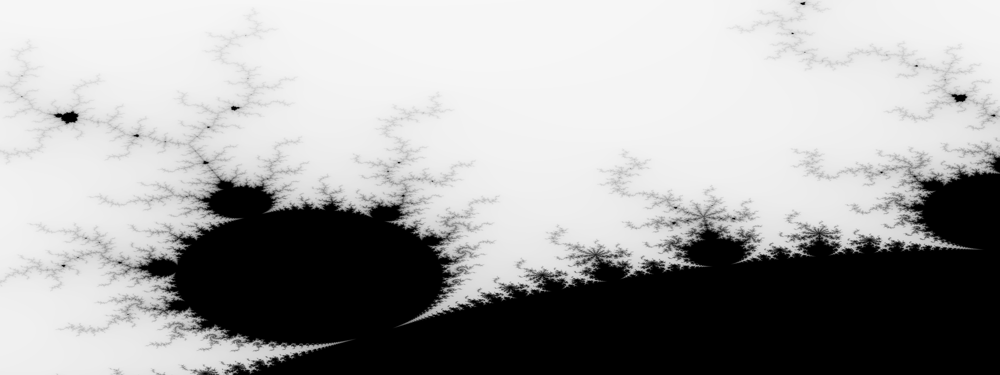

## Rust CLI Mandelbrot Set
-----

To lear how to work with the Rust progaming language I am working my way through Programming Rust, 2nd Edition(Programming Rust, 2nd Edition, n.d.). In chapter 2 the following code is used to show several core Rust feachers. Usally I don't hold on to code that I have copyed out of a text book but this particular program produces the following image . 

------
To compile run:
`cargo build --release`

Run program with:
`target/release/mandelbrot mandel.png 4000x3000 -1.20,.35 -1,0.20
`
### Mandelprot Set
-----

-----

Be carful how large you make the image as it requires a lot of computation. 